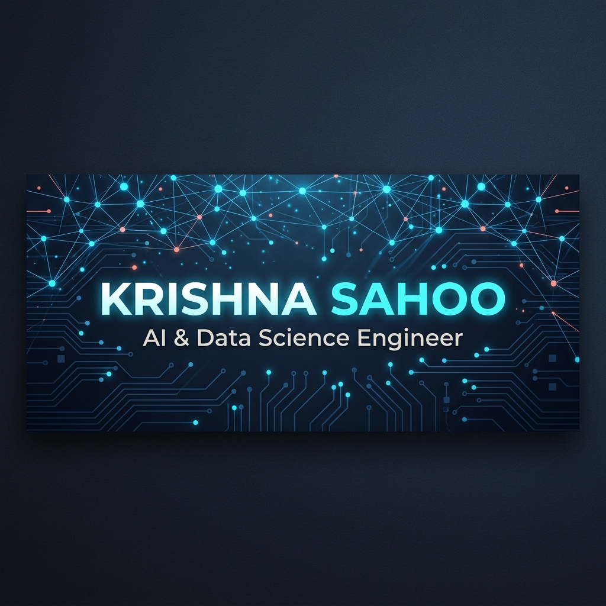

  

  

  
  
  
  
  
  
  

## 🧠 Engineering Philosophy

> *"I don't just write code. I architect systems that reason, adapt, and scale."*

I'm a **B.Tech AI & Data Science** student at VESIT, Mumbai, but my work spans the full spectrum of software engineering — from low-level algorithmic optimization to high-level system architecture. I believe the best engineers are those who can move seamlessly between abstraction layers.

**What separates my approach:**
- **Systems Thinking:** Every project starts with architecture diagrams, not `main()`. I map data flows, failure modes, and scaling bottlenecks before writing the first line of code.
- **AI-Native Development:** I don't bolt AI onto products. I design products where AI is the core infrastructure — from CrisisSync's real-time incident classification to StudySync's intelligent scheduling.
- **Full-Stack Ownership:** Frontend (React/Vite/Tailwind), Backend (Node.js/Express/Firebase), DevOps (Docker/Cloud Run), and ML (Gemini API, custom models) — I own the entire lifecycle.
- **Production-First Mindset:** Every repo has CI/CD considerations, environment configs, and deployment documentation. Side projects are treated like production systems.

**Currently architecting:** CrisisSync — an AI-powered crisis response platform with role-based portals, real-time ADI dashboards, and Google Maps integration. Built with Flutter, Firebase, and Gemini AI.

## 🏗️ Technical Architecture

### Core Systems & Languages

  
  
  
  
  

### Frontend & UI Architecture

  
  
  
  

### Backend & Infrastructure

  
  
  
  
  

### Data & AI Systems

  
  
  
  

## 📊 Engineering Metrics

  
  

  

  

## 🏆 System Achievements

  

## 🚀 Featured Systems

  
  

  
  

### 🔥 CrisisSync — AI-Powered Crisis Response Platform
**Architecture:** Flutter (Mobile) → Firebase (Backend/Auth) → Gemini AI (Classification) → Google Maps API (Tracking) → Docker/Cloud Run (Deployment)
- Real-time incident classification with severity scoring using Gemini AI
- Role-based access control: Guest, Staff, Admin portals
- Live ADI dashboard with Google Maps integration
- **Status:** Production-ready | Hackathon winner

### 📚 StudySync — Academic Productivity OS
**Architecture:** React.js + Vite + Tailwind → Firebase → Web Audio API
- Intelligent calendar with conflict detection algorithms
- Pomodoro timer with procedurally generated ambient sound
- Cloud file library with hierarchical folder system
- **Status:** Active development | Open for contributions

### ⚡ DevAgent — Autonomous Developer Onboarding
**Architecture:** Next.js + TypeScript → Gemini AI → NextAuth → Chart.js
- AI assistant for developer environment setup guidance
- Local environment verification agent (checks dev tools, dependencies)
- HR dashboard with real-time onboarding analytics
- **Status:** Hackathon prototype | Scaling to production

## 🐍 Contribution Evolution

  

## ⚔️ Algorithmic Engineering

  

> **Philosophy:** I solve problems not to memorize patterns, but to understand the underlying computational complexity and trade-offs. Every solution is documented with time/space complexity analysis and alternative approaches.

## 📝 Latest Engineering Insights

<!-- BLOG-POST-LIST:START -->
<!-- This section auto-updates via GitHub Actions every 6 hours -->
<!-- BLOG-POST-LIST:END -->

  

  

  <i>Built with precision. Maintained with passion. Powered by curiosity.</i> 
  <b>Krishna Sahoo</b> © 2026

