<!-- ═══════════════════════════════════════════════════════════ -->
<!--  SECTION 1 — ANIMATED SVG HEADER                          -->
<!-- ═══════════════════════════════════════════════════════════ -->

<div align="center">
  
</div>

<br/>

<div align="center">


&nbsp;

&nbsp;


</div>


<!-- ═══════════════════════════════════════════════════════════ -->
<!--  SECTION 2 — ABOUT ME : Terminal Window                   -->
<!-- ═══════════════════════════════════════════════════════════ -->

<div align="center">

## `> about --me`

</div>

```bash
┌──────────────────────────────────────────────────────────────┐
│  krishna@dev  ~  github-profile                        ◉ − ✕  │
└──────────────────────────────────────────────────────────────┘

  $ whoami
  -> krishnasahoo11156

  $ cat about.txt
  +----------------------------------------------------------+
  |  B.Tech - Artificial Intelligence & Data Science         |
  |  1st Year  |  India                                      |
  |                                                          |
  |  I love debugging at 2 AM and calling it fun.            |
  |  Building small projects that solve real problems.       |
  |  Currently deep-diving into Java OOP & DSA.              |
  |  Future goal: build AI that actually helps people.       |
  +----------------------------------------------------------+

  $ echo $SKILLS
  -> [ Java, HTML5, CSS3, Python, Git, GitHub ]

  $ echo $LEARNING
  -> [ Java_OOP, DSA, Responsive_WebDev, ML_Basics ]

  $ echo $STATUS
  -> "Building things. Breaking things. Learning fast."

  $ uptime
  -> 1st year of a 4-year mission  [======------]  25%

  $ _  <- cursor blinking...
```


<!-- ═══════════════════════════════════════════════════════════ -->
<!--  SECTION 3 — TECH STACK : skill-icons                     -->
<!-- ═══════════════════════════════════════════════════════════ -->

<div align="center">

## `> ls ./tech-stack`

**// Core Arsenal**

[](https://skillicons.dev)

<br/>

**// Currently Exploring** &nbsp;🔭

[](https://skillicons.dev)

> 🧪 *These are still being unlocked — progress: `[====--------]` ~35%*

</div>


<!-- ═══════════════════════════════════════════════════════════ -->
<!--  SECTION 4 — GITHUB STATS                                  -->
<!-- ═══════════════════════════════════════════════════════════ -->

<div align="center">

## `> git log --stat`

<table>
<tr>
<td align="center" width="50%">


</td>
<td align="center" width="50%">


</td>
</tr>
</table>


<br/>


</div>


<!-- ═══════════════════════════════════════════════════════════ -->
<!--  SECTION 5 — SNAKE CONTRIBUTION GRAPH                     -->
<!--  Setup: Settings → Actions → Workflow permissions         -->
<!--         → Read and write → Save                           -->
<!--  Then:  Actions tab → "Generate Snake Animation"          -->
<!--         → Run workflow (manually, first time)             -->
<!-- ═══════════════════════════════════════════════════════════ -->

<div align="center">

## `> ./snake.sh --eat-contributions`

<picture>
  <source media="(prefers-color-scheme: dark)"
    srcset="https://raw.githubusercontent.com/krishnasahoo11156/krishnasahoo11156/output/github-contribution-grid-snake-dark.svg"/>
  <source media="(prefers-color-scheme: light)"
    srcset="https://raw.githubusercontent.com/krishnasahoo11156/krishnasahoo11156/output/github-contribution-grid-snake.svg"/>
  
</picture>

</div>


<!-- ═══════════════════════════════════════════════════════════ -->
<!--  SECTION 6 — PROJECTS : Accordion                         -->
<!-- ═══════════════════════════════════════════════════════════ -->

<div align="center">

## `> ls ./projects --details`

</div>

<details>
<summary><b>🌐 Personal Portfolio Website</b> &nbsp;·&nbsp; <code>HTML · CSS · Vercel</code> &nbsp;·&nbsp; <i>click to expand ▾</i></summary>
<br/>

> A sleek, fully responsive personal portfolio showcasing my skills, journey, and projects. Built from scratch with pure HTML & CSS — no frameworks.

**✨ Highlights:**
- Fully responsive across all screen sizes
- Smooth scroll and CSS hover animations
- Live project showcase with working links
- Contact section

**🔗 Links:**
&nbsp; [](https://krishna-portfolio-lake-psi.vercel.app/)
&nbsp; [](https://github.com/krishnasahoo11156)

**🛠️ Stack:** `HTML5` · `CSS3` · `Vercel`

<br/>
</details>

<details>
<summary><b>☕ Java DSA Mastery Repository</b> &nbsp;·&nbsp; <code>Java · OOP · Algorithms</code> &nbsp;·&nbsp; <i>click to expand ▾</i></summary>
<br/>

> A structured, growing collection of Data Structures & Algorithms implemented in Java. Every file is a step forward in my problem-solving journey.

**✨ What's Inside:**
- Basic Java programs (Calculator, SimpleInterest, CurrencyConverter)
- OOP concepts with real-world examples
- Upcoming: Arrays, LinkedLists, Stacks, Queues, Trees

**📈 Progress:** `[========------]` ~55% through fundamentals

**🔗 Links:**
&nbsp; [](https://github.com/krishnasahoo11156/DSA)

**🛠️ Stack:** `Java` · `VS Code / IntelliJ IDEA`

<br/>
</details>

<details>
<summary><b>🎨 Responsive Web Design Collection</b> &nbsp;·&nbsp; <code>HTML · CSS · Layouts</code> &nbsp;·&nbsp; <i>click to expand ▾</i></summary>
<br/>

> A curated set of responsive web pages built while mastering Flexbox, CSS Grid, media queries, and modern design patterns.

**✨ What's Inside:**
- Landing pages with animated sections
- Sticky navigation bars & hamburger menus
- Card grids and responsive image galleries
- CSS-only animations and transitions

**🔗 Links:**
&nbsp; [](https://github.com/krishnasahoo11156)

**🛠️ Stack:** `HTML5` · `CSS3` · `Flexbox` · `Grid`

<br/>
</details>

<details>
<summary><b>🤖 ML Explorer Notebook</b> &nbsp;·&nbsp; <code>Python · NumPy · Pandas</code> &nbsp;·&nbsp; <i>🔄 In Progress</i></summary>
<br/>

> My personal Machine Learning exploration journal — running experiments, learning model fundamentals, and building intuition for data.

**🧪 Status:** Early stage — currently covering NumPy arrays and Pandas DataFrames.

**📌 Planned:**
- Linear & Logistic Regression from scratch
- Data cleaning & visualization pipelines
- First Scikit-learn model deployment

**🛠️ Stack:** `Python` · `NumPy` · `Pandas` · `Matplotlib` · `Jupyter`

<br/>
</details>


<!-- ═══════════════════════════════════════════════════════════ -->
<!--  SECTION 7 — LEARNING ROADMAP : Progress bars             -->
<!-- ═══════════════════════════════════════════════════════════ -->

<div align="center">

## `> progress --show-all`

</div>

```
  +--------------------------------------------------------------------+
  |                   2025 LEARNING ROADMAP                            |
  +====================+=======================+========+=============+
  | SKILL              | PROGRESS              | DONE   | STATUS      |
  +--------------------+-----------------------+--------+-------------+
  |                                                                    |
  |   JAVA & DSA                                                       |
  |   Java Basics      | [============------]  |  60%   | Done        |
  |   Java OOP         | [========----------]  |  40%   | In progress |
  |   DSA (Arrays)     | [======------------]  |  30%   | In progress |
  |   DSA (Trees/DP)   | [==----------------]  |  10%   | Upcoming    |
  |                                                                    |
  |   WEB DEVELOPMENT                                                  |
  |   HTML5            | [==============----]  |  70%   | Done        |
  |   CSS3 / Layouts   | [============------]  |  60%   | Done        |
  |   Responsive Web   | [========----------]  |  40%   | In progress |
  |   JavaScript       | [====----------------]|  20%   | Up next     |
  |   React.js         | [=-----------------]  |   5%   | Upcoming    |
  |                                                                    |
  |   AI & MACHINE LEARNING                                            |
  |   Python Basics    | [========----------]  |  40%   | In progress |
  |   NumPy / Pandas   | [====------------]    |  20%   | Starting    |
  |   ML Models        | [==----------------]  |  10%   | Upcoming    |
  |   Deep Learning    | [------------------]  |   0%   | Far future  |
  |                                                                    |
  |   TOOLS & DEVOPS                                                   |
  |   Git / GitHub     | [============------]  |  60%   | Done        |
  |   CI/CD Basics     | [====------------]    |  20%   | Upcoming    |
  |   Open Source      | [==----------------]  |  10%   | This year   |
  |                                                                    |
  |   Done=[==]   In Progress=[==]   Upcoming=[--]                    |
  +--------------------------------------------------------------------+
```


<!-- ═══════════════════════════════════════════════════════════ -->
<!--  SECTION 8 — CONNECT : Social links                       -->
<!-- ═══════════════════════════════════════════════════════════ -->

<div align="center">

## `> connect --all`


<br/><br/>

[](https://www.linkedin.com/in/krishna-sahoo-b3440537a)
[](https://leetcode.com/u/KrishnaSahoo11156/)
[](mailto:krishnasahoo11156@gmail.com)
[](https://instagram.com/krishnasahoo11156)
[](https://krishna-portfolio-lake-psi.vercel.app/)

</div>


<!-- ═══════════════════════════════════════════════════════════ -->
<!--  SECTION 9 — FOOTER                                       -->
<!-- ═══════════════════════════════════════════════════════════ -->

<div align="center">

⚡ Open to collaborations &nbsp;·&nbsp; 🌱 Always learning &nbsp;·&nbsp; ☕ Powered by coffee &nbsp;·&nbsp; 🤖 Future AI Engineer &nbsp;·&nbsp; 🚀 Building the future

<br/>

*"The expert in anything was once a beginner who refused to give up."*

<br/>

<sub>Made with 💙 by <a href="https://krishna-portfolio-lake-psi.vercel.app/">Krishna Sahoo</a> &nbsp;·&nbsp; Updated 2025</sub>

</div>
